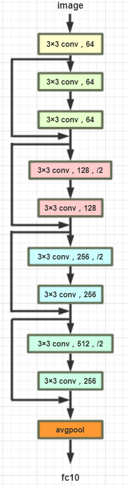
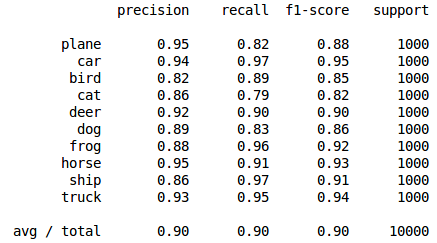
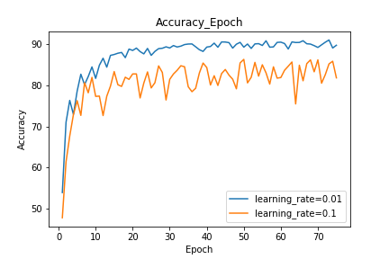
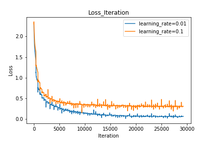
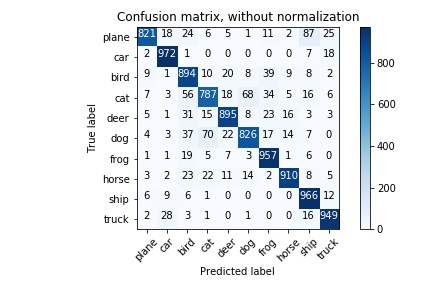

## CIFAR10_Classification
AI introduction project 2

### Dependencies

    torch=>0.4.1
    sklearn=>0.19.1

### Model

    

  

### Train model

    python train.py --output (PATH) --learning_rate --batch_size --epoch

### Model Evaluation
codes are in test.ipynb/plot.ipynb
    
    jupyter notebook

    

### Curves

    

    

### Confusion_matrix

    

